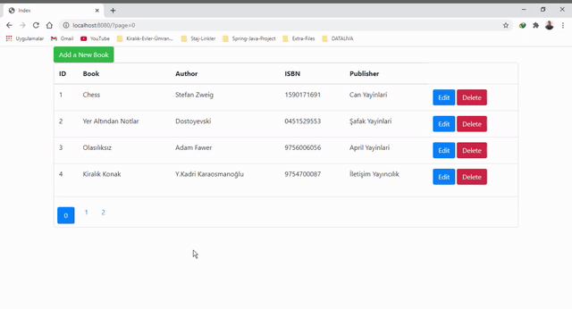

# LibraryAppWithSpringBoot
I made an Library Web Project with Java Spring first time in my life. The front-end is made using HTML/CSS. Spring framework is really affective and impresive for me. Because even it is first time for me to use this technology after making some search I easily adapted and made an such an great Web Project. This project is just an beginning for me. I also made some projects with using Java. So it wasn't so difficult for me.

## Web

# Kullanılan Teknolojiler

- Spring
- JPA
- Hibernate
- h2 database
- HTML
- CSS
- Javascript

## Setup

- Install Intellij IDEA
- Set the project with using Maven however you want
- Open the project you built with Maven
- Edit the codes like you wanted
- Click Run Button
- Jump on the browser type localhost:8080
- See the results
